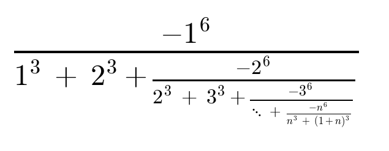
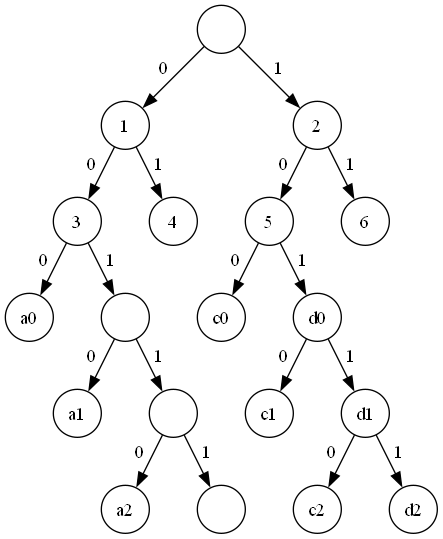
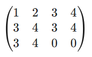
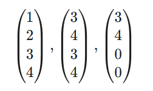

# Math visual helpers

All sort of helper methods used to present mathematics

### Remark:
> Unfortunately, the LaTeX support inside python is not too helpful in case you want to actually generate the 
> LaTeX image itself. So while we can generate the strings, some of them cannot be converted into images (e.g. 
> it doesn't recognise `\begin{...}`).

## Continued fraction expressions
Generator of generalized continued fractions as in the example below. See this [google colab notebook](https://colab.research.google.com/drive/1nQy1q_-6ik0ylvbXvW2jRzZkaLhLzMG5?usp=sharing) 
for examples, or the file `tests/test_continued_fractions.py`.

## Graph Drawing
Draw binary trees in a "compact" way. See the `tests\test_graphs.py` for examples.

Was a great tool in my [notes about Huffman codes](https://drive.google.com/file/d/14iJaLgw66eKPS27O2w4_szyeTwQTGn7U/view?usp=sharing).

## Matrices and vector lists from arrays
Use 2D arrays to form either matrices of lists of vectors. Was useful in [my notes about
Jordan decomposition](https://colab.research.google.com/drive/1yL-DoADRlu2FxsT_kjK5mZhjxk2GKqyw?usp=sharing).

